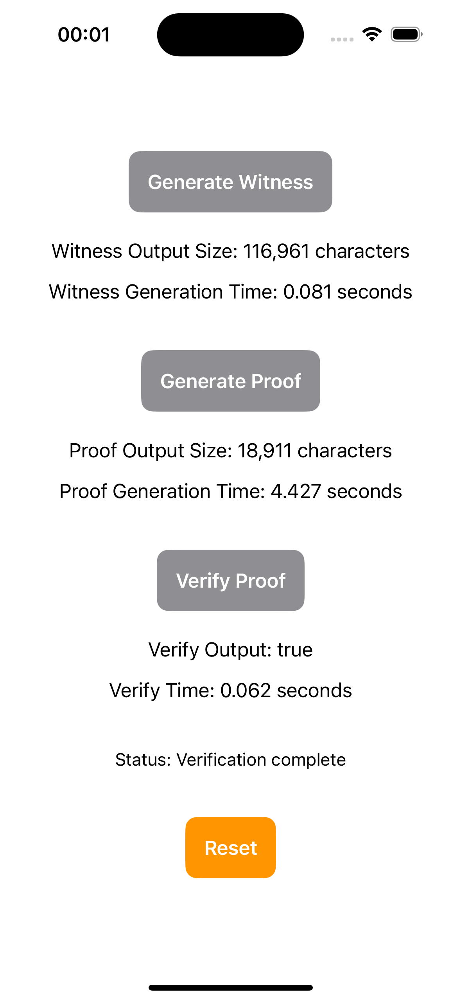

# EZKL iOS Package

Welcome to the **EZKL iOS Package**! This repository provides a Swift Package for integrating the [EZKL](https://ezkl.xyz) library into your iOS applications using Swift Package Manager. With this package, you can utilize EZKL's zero-knowledge proof capabilities directly within your Xcode projects.

> **Note:** This is an experimental project and should not be used in production environments.

---

## Overview

This package is an iOS port of the EZKL library, which allows you to generate and verify zero-knowledge proofs (ZKPs) for neural networks. It provides Swift bindings to the core EZKL functionalities, enabling you to:

- **Generate Witnesses**: Use `genWitness` to generate a witness for a given neural network and input data.
- **Generate Proofs**: Use `prove` to generate a ZKP based on the witness and circuit.
- **Verify Proofs**: Use `verify` to verify the generated proof against the circuit and input.

You can learn more about EZKL and its capabilities at [ezkl.xyz](https://ezkl.xyz).

---

## Example App

An example iOS application demonstrating how to use EZKL within an iOS app is available in the [Example](Example) directory.
 


---

## Installation

### Important Note on Git LFS

Currently, Xcode's Swift Package Manager does not fully support Git Large File Storage (LFS). Due to this limitation, you need to install the package manually by downloading it from GitHub and adding it as a local package dependency in your Xcode project.

For more information on this issue, see [SwiftPM with Git LFS](https://forums.swift.org/t/swiftpm-with-git-lfs/42396).

### Steps to Install the Package

1. **Download the Package:**

   - Clone the repository or download it as a ZIP file from GitHub.
     ```bash
     git clone https://github.com/ElusAegis/ezkl-ios-port.git
     ```
   - Ensure that you have Git LFS installed to handle large files:
     ```bash
     git lfs install
     git lfs pull
     ```
   > Alternatively, you can download the ZIP file from the GitHub repository.

2. **Add as a Local Package Dependency:**

   - In your Xcode project, go to **File** > **Add Packages...**
   - Click on **Add Local...**
   - Select the directory where you cloned or downloaded the `ezkl-ios-port` repository.
   - Xcode will add the package to your project.

---

## Requirements

- **Xcode**: Version 12 or later.
- **Swift**: Version 5.3 or later.
- **Git LFS**: Required to handle large files in the package.

---

## Usage

### Initial Setup

Before using the EZKL functions in your app, you need to perform some initial setup using the EZKL CLI on your development machine or server:

1. **Compile the Neural Network Circuit:**

   - Use the EZKL CLI to compile your `.onnx` neural network model into a `.ezkl` circuit file.

2. **Generate Supporting Files:**

   - **Settings File**: Generate the settings file required for the circuit.
   - **Structured Reference String (SRS)**: Obtain the SRS, which is necessary for proof generation and verification.
   - **Proving Key (PK) and Verification Key (VK)**: Generate the PK and VK using the SRS.

3. **Bundle the Files in Your App:**

   - Include the generated `.ezkl` circuit file, settings, SRS, PK, and VK in your Xcode project, ensuring they are accessible at runtime.

For more detailed instructions on using the EZKL CLI and generating the necessary files, refer to the [EZKL Documentation](https://docs.ezkl.xyz/getting_started/).

### Using the Package in Your Code

Import the EZKL module in your Swift files:

```swift
import EzklCore
```

#### Generating a Witness

```swift
let inputJson = /* Your input data as Json string */
let compiledCircuitData = /* Data representation of your compiled circuit */
let vkData = /* Data representation of your verification key */
let srsData = /* Data representation of your SRS */

EzklCore.genWitness(
    inputJson: inputJson,
    compiledCircuit: compiledCircuitData,
    vk: vkData,
    srs: srsData
) { result in
    switch result {
    case .success(let witnessJson):
        // Use the witnessJson for proof generation
    case .failure(let error):
        // Handle error
    }
}
```

#### Generating a Proof

```swift
let witnessJson = /* The witness Json generated earlier */
let pkData = /* Data representation of your proving key */
let srsData = /* Data representation of your SRS */

EzklCore.prove(
    witnessJson: witnessJson,
    compiledCircuit: compiledCircuitData,
    pk: pkData,
    srs: srsData
) { result in
    switch result {
    case .success(let proofJson):
        // Use the proofJson as needed
    case .failure(let error):
        // Handle error
    }
}
```

#### Verifying a Proof

```swift
let proofJson = /* The proof Json generated earlier */
let settingsJson = /* The settings Json for your circuit */
let vkData = /* Data representation of your verification key */
let srsData = /* Data representation of your SRS */

EzklCore.verify(
    proofJson: proofJson,
    settingsJson: settingsJson,
    vk: vkData,
    srs: srsData
) { result in
    switch result {
    case .success(let isValid):
        if isValid {
            // Proof is valid
        } else {
            // Proof is invalid
        }
    case .failure(let error):
        // Handle error
    }
}
```

---

## Important Notes

- **Data Formats:**

  - **Input and Settings:** Should be provided as Json strings.
  - **Circuit, PK, VK, SRS:** Should be loaded as binary `Data`.

- **EZKL CLI Usage:**

  - The EZKL CLI is used to prepare necessary files (circuit, settings, keys, SRS) before using the package.
  - For more information on using the EZKL CLI, refer to the [EZKL Documentation](https://ezkl.xyz).

---

## Regenerating the Package

The package is built from the Rust EZKL library using the [ezkl-ios-rust-porter](https://github.com/ElusAegis/ezkl-ios-rust-porter) repository. If you wish to regenerate the bindings manually:

1. **Clone the Porter Repository:**

   ```bash
   git clone https://github.com/ElusAegis/ezkl-ios-rust-porter.git
   ```

2. **Generate the Bindings:**

   - Follow the instructions in the `ezkl-ios-rust-porter` repository to generate the bindings.